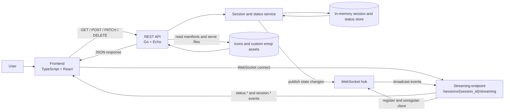
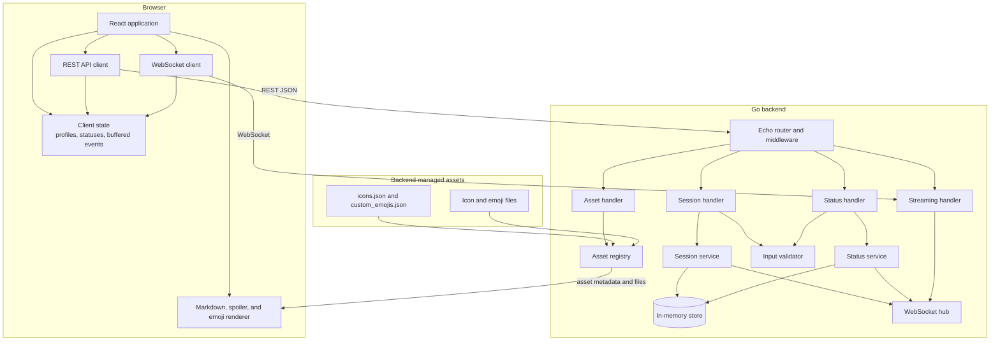
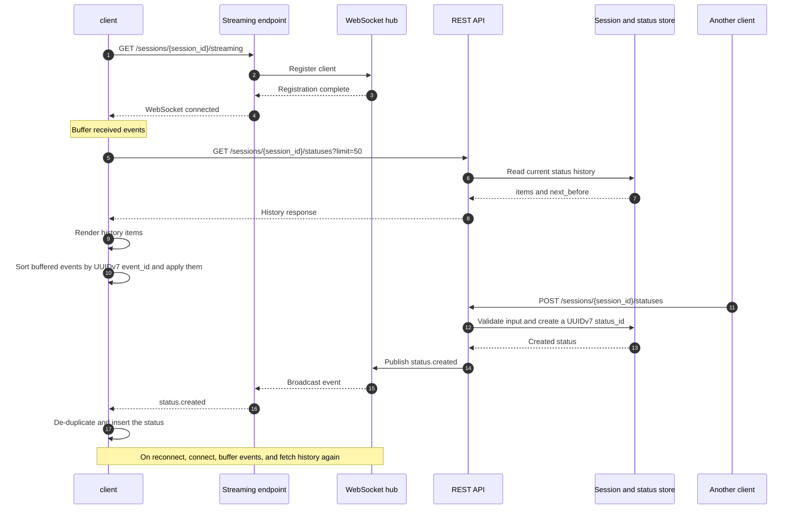

# mermaid diagrams

## システムフロー

投稿の取得と作成・更新・削除には REST API を使います。
WebSocket は、接続後に発生した状態変更イベントを配信するためだけに使います。

- サーバーの再起動時にインメモリのセッション・投稿データは初期化されます
- アイコンとカスタム絵文字の一覧・画像はバックエンド側で管理し、フロントエンドは API の応答を使って表示します
- 投稿・セッション・イベントのサーバー生成 ID には UUIDv7 を使います

## コンポーネント図

フロントエンドは REST API と WebSocket のクライアントを分離し、バックエンドは HTTP の入出力、業務処理、状態保持、イベント配信、アセット配信を別コンポーネントとして扱います。

- `StatusService` と `SessionService` は、状態を変更した後に WebSocket Hub へイベントを発行します。
- `Validator` は `config.yaml` の文字数制限と、許可されたアイコン ID を検証します。
- `AssetRegistry` は JSON マニフェストを読み込み、アイコン・カスタム絵文字の一覧 API と静的アセット配信に利用します。
- `Client state` は REST の投稿履歴と WebSocket の差分イベントを統合し、再接続時には履歴 API の結果を正とします。

## 初回同期と投稿配信

クライアントは WebSocket を先に接続してイベントをバッファし、その後に REST API で投稿履歴を取得します。
これにより、履歴取得中に届いたイベントを取りこぼさないようにします。

- `GET /sessions/{session_id}/statuses` は投稿履歴を返します。`before` と `next_before` を使い、古い履歴を追加で取得します
- WebSocket は履歴を再送せず、`status.created`、`status.updated`、`status.deleted` などの差分イベントだけを配信します
- UUIDv7 の順序は概ね時系列ではありますが、同一ミリ秒に発生した操作の厳密な因果順序は保証しないものとします
- 削除は冪等に扱います
- 同じ投稿 ID の更新は `updated_at` が新しい状態を優先します
- 同期結果に矛盾を検出した場合、クライアントは投稿履歴 API を再取得して最新状態へ戻します
